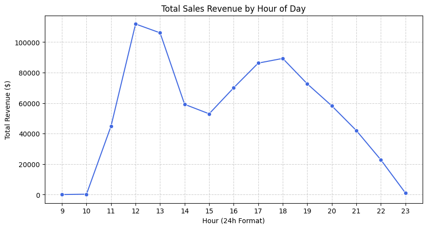
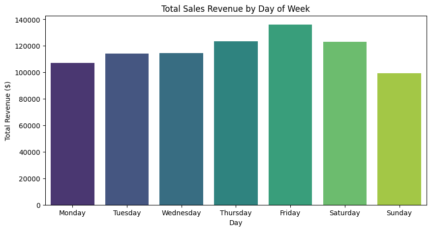
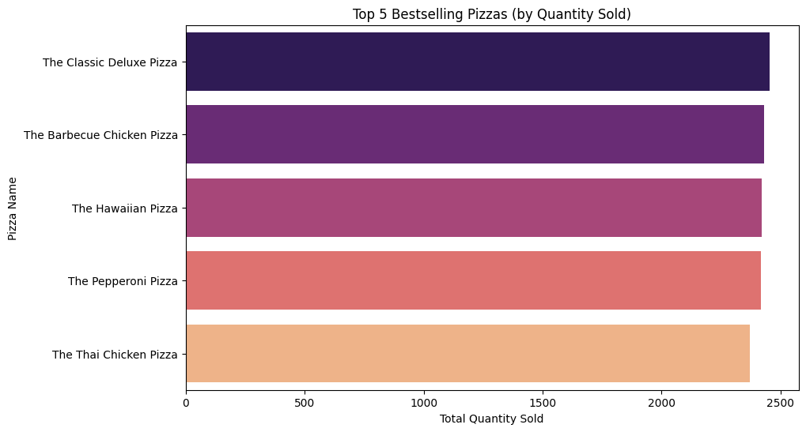
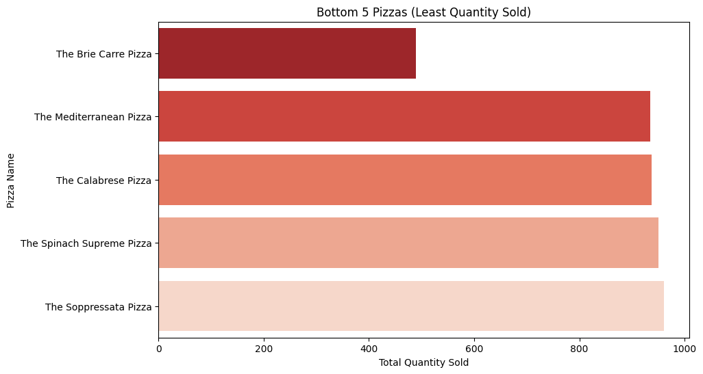

🍕 ​🍕 Pizza Place Sales Performance Analysis ​📌 Executive Summary 

​This project analyzes a year's worth of sales data from a fictitious pizza restaurant to identify growth opportunities, peak operational times, and menu performance. By merging datasets covering orders, pizza specifications, and ingredients, we generated actionable insights to optimize staffing and inventory.

​🚀 Key Business Insights

​1. Hourly Sales Trends (Peak Times) 

​The restaurant experiences two primary "rushes." The lunch rush (12:00 PM – 1:00 PM) and the dinner rush (5:00 PM – 7:00 PM). Staffing should be prioritized during these windows to ensure fast service.

​2. Daily Revenue Patterns 

​Friday is the highest-grossing day of the week. Revenue remains strong through Saturday but dips significantly on Sunday, suggesting a need for weekend-specific marketing or family-bundle promotions.

​3. Monthly Sales Seasonality 

​Sales are remarkably stable throughout the year, with slight peaks in May and July. This indicates a consistent customer base that does not fluctuate heavily with seasons.

​4. Top 5 Bestselling Pizzas 

​The Classic Deluxe Pizza and the Barbecue Chicken Pizza lead the menu in popularity. These "hero products" should be featured prominently in advertisements.

​5. Underperforming Menu Items (Bottom 5) 

​The Brie Carre Pizza is the lowest-selling item by a wide margin. Management should consider whether to retire this item or re-brand it to reduce inventory waste.

​🛠️ Technical Implementation ​Data Merging: Joined orders, order_details, pizzas, and pizza_types into a single analytical dataframe. ​Cleaning: Handled date/time formatting and calculated total_price (Quantity × Price). ​Visuals: Generated using Seaborn and Matplotlib for high-impact storytelling.

​📁 Repository Structure ​Pizza_Sales_Analysis.ipynb: Complete Python code and documentation. ​hourly_sales.png, daily_sales.png, etc.: Individual visual assets. ​datasets/: Original CSV files used for analysis. 
